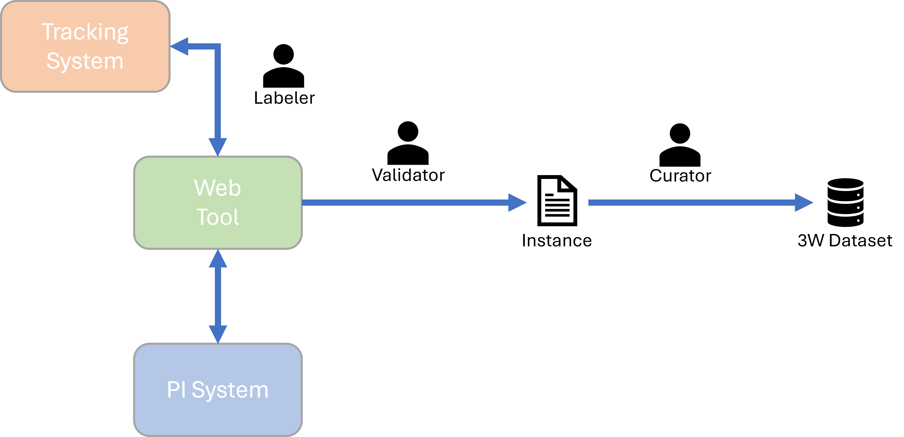
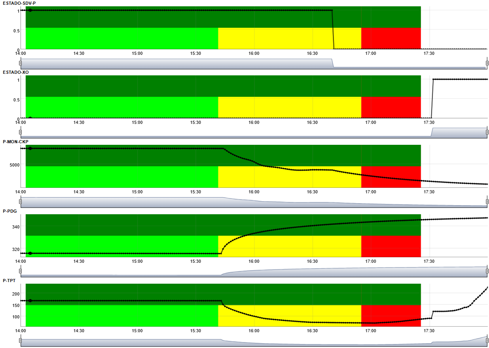
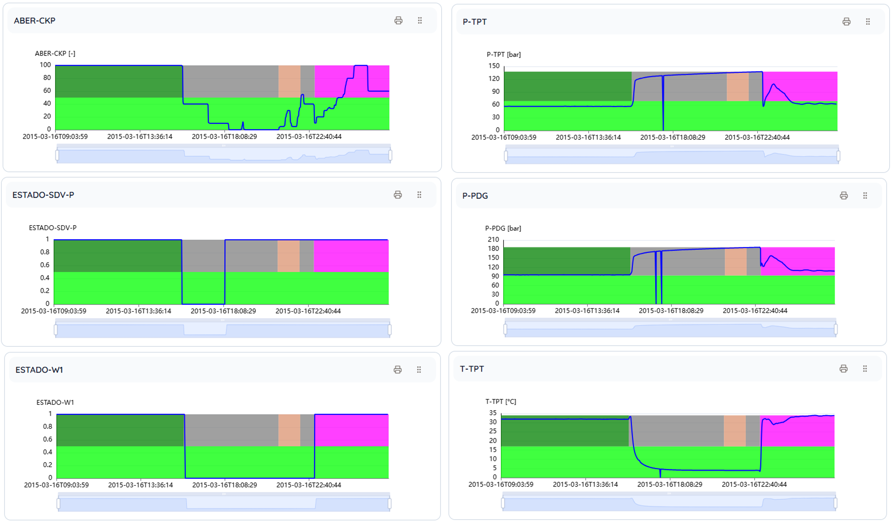
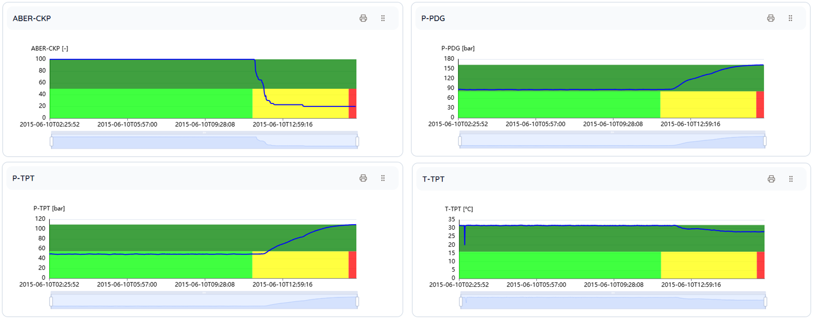
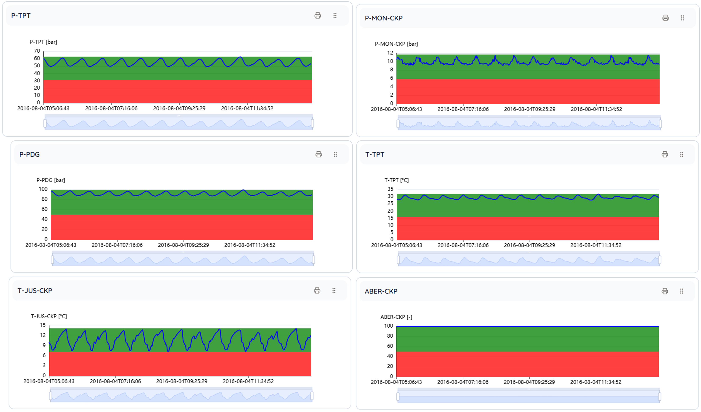
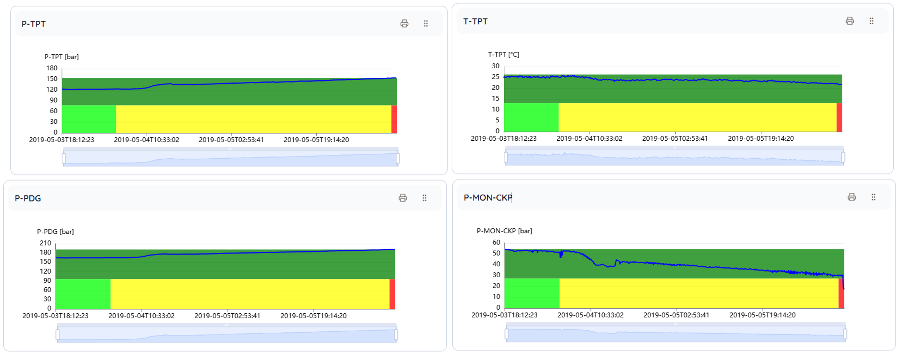
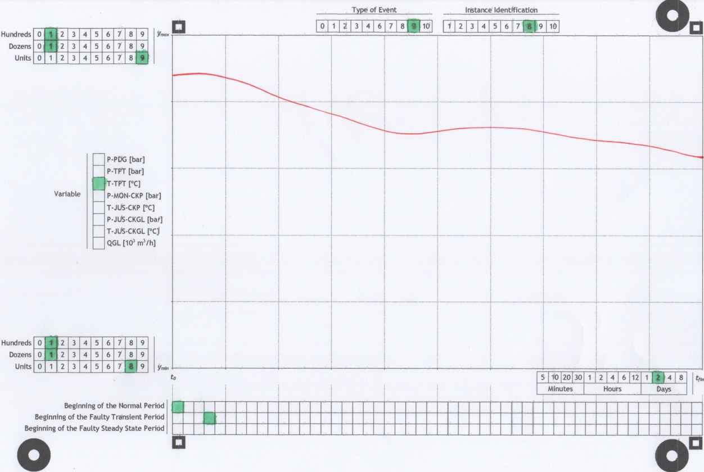
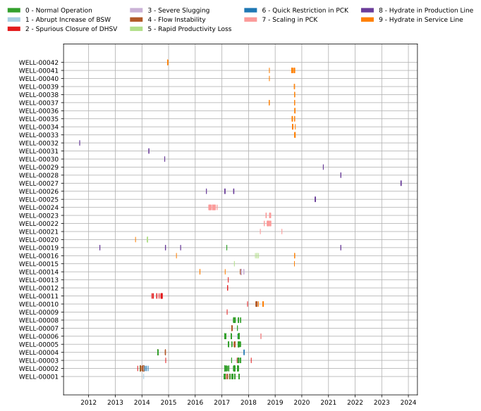
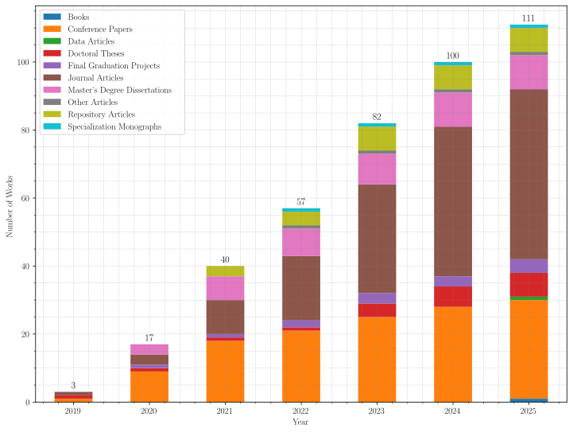

# Data Article About the 3W Dataset 2.0.0

This file contains a ***draft version*** of the [data article](http://researchdata.springernature.com/posts/data-articles-what-are-they-and-how-can-they-benefit-me) intended to be published about the [3W Dataset ***2.0.0***](https://github.com/petrobras/3W/tree/main/dataset).

The content of the following section has been designed with the aim of increasing productivity during the development of this [data article](http://researchdata.springernature.com/posts/data-articles-what-are-they-and-how-can-they-benefit-me) in an open and collaborative way with the [3W Community](https://github.com/petrobras/3W/blob/main/community/README.md).

The following second section contains the ***draft version*** of the [data article](http://researchdata.springernature.com/posts/data-articles-what-are-they-and-how-can-they-benefit-me) itself.

## Alignments Among Authors

The content of this file in its current version is the result of an ***in-depth evaluation*** of the following sources of guidance:

* [For Authors | Scientific Data](https://www.nature.com/sdata/submission-guidelines)
* [Submission Guidelines | Scientific Data](https://www.nature.com/sdata/publish/submission-guidelines)
* [Data Policies | Scientific Data](https://www.nature.com/sdata/policies/data-policies)
* [Data Repository Guidance | Scientific Data](https://www.nature.com/sdata/policies/repositories#general)

All the sections of this file should be duly revised during the development of this [data article](http://researchdata.springernature.com/posts/data-articles-what-are-they-and-how-can-they-benefit-me).

### Definitions

1. This [data article](http://researchdata.springernature.com/posts/data-articles-what-are-they-and-how-can-they-benefit-me) will be submitted to [Scientific Data (Springer Nature)](https://www.nature.com/sdata) according to the following [STAGES AND DEADLINES](STAGES_AND_DEADLINES.md);
    * This definition stems from the following discussion: [How should we publish this article?](https://github.com/ricardoevvargas/data-articles-3w-dataset/discussions/2)
1. This submission will be made through the [Scientific Data online manuscript submission and tracking system](https://mts-scidata.nature.com/cgi-bin/main.plex);
    * At the end of the last stage of this work by [Ricardo Vargas](https://github.com/ricardoevvargas).
1. The publication fee for this [data article](http://researchdata.springernature.com/posts/data-articles-what-are-they-and-how-can-they-benefit-me) (US$ 2,490), charged by [Scientific Data (Springer Nature)](https://www.nature.com/sdata), will be paid by Petrobras;
    * This definition was announced [here](https://github.com/ricardoevvargas/data-articles-3w-dataset/discussions/8);
    * The [3W Project](https://github.com/petrobras/3W) is one of the main projects of the Petrobras' program called [Connections for Innovation  - Open Lab Module](https://tecnologia.petrobras.com.br/modulo-open-lab);
    * The publication of this [data article](http://researchdata.springernature.com/posts/data-articles-what-are-they-and-how-can-they-benefit-me) is essential for the development and success of the [3W Project](https://github.com/petrobras/3W).
1. A copy of the [3W Dataset ***2.0.0***](https://github.com/petrobras/3W/tree/main/dataset) will be deposited at [Figshare](https://figshare.com/) under the [CC-BY](https://creativecommons.org/licenses/by/4.0/) license during this [data article](http://researchdata.springernature.com/posts/data-articles-what-are-they-and-how-can-they-benefit-me) submission process;
    * The [3W Dataset ***2.0.0***](https://github.com/petrobras/3W/tree/main/dataset) is already licensed with [CC-BY](https://creativecommons.org/licenses/by/4.0/). Details [here](https://github.com/petrobras/3W/blob/main/dataset/LICENSE-CC-BY);
    * [Figshare](https://figshare.com/) is the most favorable option among the repositories considered reliable by [Scientific Data (Springer Nature)](https://www.nature.com/sdata). Details [here](https://www.nature.com/sdata/policies/repositories#general);
    * GitHub is not a repository option accepted by [Scientific Data (Springer Nature)](https://www.nature.com/sdata).
1. This [data article](http://researchdata.springernature.com/posts/data-articles-what-are-they-and-how-can-they-benefit-me) will be developed with the [Scientific Data (Springer Nature)](https://www.nature.com/sdata)'s [Data Descriptor](https://www.nature.com/sdata/publish/submission-guidelines#sec-1).
    * The other content types (***article*** and ***comment***) are not suitable for our purpose. Details [here](https://www.nature.com/sdata/publish/submission-guidelines#sec-1).

### Specific Goals with this Draft Version

1. Start the development of this [data article](http://researchdata.springernature.com/posts/data-articles-what-are-they-and-how-can-they-benefit-me) with the right structure;
    * Structure forced by the [Scientific Data (Springer Nature)](https://www.nature.com/sdata)'s [Data Descriptor](https://www.nature.com/sdata/publish/submission-guidelines#sec-1).
1. Facilitate consultation of the guidelines related to the purposes of the [Data Descriptor](https://www.nature.com/sdata/publish/submission-guidelines#sec-1) sections;
    * The purpose of each section is transcribed in this file, highlighted with the 💡emoji, and it shouldn't be edited.
1. Specify the contents in each section to encourage and facilitate contributions by those interested in becoming co-authors of this [data article](http://researchdata.springernature.com/posts/data-articles-what-are-they-and-how-can-they-benefit-me);
    * Contents can be paragraphs, figures, equations, tables, and graphs;
    * Each piece of content is specified in its own unenumerated list item;
    * In some sections (Title, Abstract, Corresponding author, ...), there are no lists of contents, but rather developed ***preliminary versions*** of the contents deemed necessary.
1. Provide a complete and cohesive ***big picture*** of this [data article](http://researchdata.springernature.com/posts/data-articles-what-are-they-and-how-can-they-benefit-me) before each section's content is developed.

### Meaning of the Emojis

* 💡 Highlights the purposes of the existens sections in the [Data Descriptor](https://www.nature.com/sdata/publish/submission-guidelines#sec-1);
* ✅ Indicates that the section is considered ready to be submitted for review;
* ⁉️ Indicates that the section has content listed or drafted, but that it is not yet ready to be submitted for review;
* 👍 Indicates expected contributions in a given section;
* 🚧 Indicates that the section does not have content listed or prepared yet.

### Before You Contribute

The following step-by-step is suggested:

1. Read the [README.md](../README.md);
1. Read [this section](#alignments-among-authors) ***carefully***;
1. Consult the sources and guidelines listed above as necessary;
1. Propose through [Pull Requests](https://docs.github.com/pt/pull-requests/collaborating-with-pull-requests/proposing-changes-to-your-work-with-pull-requests/about-pull-requests) new versions of this file with additional and/or developed content. Corrections and/or improvements to content already developed are also welcome.

## The Data Article

### Title ✅

3W Dataset 2.0.0: a realistic and public dataset with rare undesirable real events in oil wells

### Abstract ✅

In the oil industry, undesirable events in oil wells can cause economic losses, environmental accidents, and human casualties. Artificial Intelligence and Machine Learning based solutions for Early Detection of such events have proven valuable for diverse applications across industries. In 2019, recognizing the importance and the lack of public datasets related to undesirable events in oil wells, Petrobras developed and publicly released the first version of the 3W Dataset, which is essentially a set of Multivariate Time Series labeled by experts. Since then, the 3W Dataset has been developed collaboratively and has become a foundational reference for numerous works in the field. This data article describes the current publicly available version of the 3W Dataset, which contains structural modifications and additional labeled data. The detailed description provided encourages and supports the 3W Community and new 3W users to improve previous published results and to develop new robust methodologies, digital products and services capable of detecting undesirable events in oil wells with enough anticipation to enable corrective or mitigating actions.

### Background & Summary ✅

Undesirable events cause different types of damage to the oil industry, including economic losses, environmental accidents, and human casualties [[1]](#1).

Abnormal Event Management (AEM) refers to systematic detection, diagnosis, and mitigation of unexpected or irregular events within complex industrial systems [[2]](#2). In the oil industry, where operational safety, environmental protection, and economic performance are tightly coupled, AEM is crucial for minimizing the impact of undesirable events. The integration of Artificial Intelligence (AI) and Machine Learning (ML) based solutions into AEM have shown promise for Early Detection [[3]](#3) of undesirable events in different industries [[4]](#4). By analyzing vast streams of operational data, such as pressure, temperature, vibration, and flow rates, algorithms can uncover subtle patterns that precede abnormal conditions, allowing early intervention and preventive maintenance strategies [[5]](#5). A requirement that is recognized as essential in this type of approach is the use of high-quality datasets [[6]](#6) [[7]](#7).

In 2019, Petrobras — the largest oil company in Brazil, which operates in the exploration, production, refining, marketing, and transportation of oil, natural gas, and energy — recognized this need and then developed and published the first version of the 3W Dataset, which is described in detail by Vargas et al. [[8]](#8). 

The 3W Dataset is essentially a set of Multivariate Time Series (MTS) [[9]](#9)[[10]](#10), also called instances, labeled by experts from Petrobras and its partners. The name 3W was chosen because this dataset is composed of instances from ***3*** different sources (real, simulated, and hand-drawn) and which contain undesirable events that occur in oil ***W***ells. Each instance can contain 100% of the data relating to normality or part of the data relating to a single type of undesirable event. The basic idea is that temporal signatures between multiple variables of each type of event and normality can be learned (modeled) from a set of MTS.

The main features of the 3W Dataset are as follows. Its real instances correspond to the real industrial environment. Frozen variables, missing variables, outliers, etc. are not treated intentionally. The idea is to encourage and enable the development of methodologies and digital products capable of dealing with real adversities. Therefore, it has been advocated that the preservation of characteristics typical of the real industrial environment generates high-quality datasets. Simulated instances have been added because some types of undesirable events are rare in real life. Hand-drawn instances have been added because some rare events are complicated to simulate and experts are familiar with the variables' behavior during these events.

Due to its features, the 3W Dataset can also be used to train basic models in Transfer Learning Frameworks [[11]](#11). This kind of framework rely on a large and general dataset as a reference or starting point for training a model to solve a different but related challenge, particularly when an adequate training dataset of its own is unavailable. This approach is commonly used in Deep Learning Applications [[12]](#12), especially those requiring large amounts of training data.

As the 3W Dataset has been managed with Semantic Versioning [[13]](#13), its first version is identified by the code 1.0.0.

Since its first publication, the 3W Dataset has been explored by several people who make up the 3W Community [[14]](#14), including independent professionals and representatives of research institutions, startups, companies, and oil operators from different countries. 

Several works that have been developed and published by the 3W Community has formed a considerable scientific framework related to Early Detection of undesirable events in oil wells. This framework is composed by books, conference papers, doctoral theses, final graduation projects, journal articles, master's degree dissertations, repository articles, and specialization monographs. Publications identified so far that cite the 3W Dataset are listed in the 3W Project repository [[15]](#15).

In 2022, Petrobras created the 3W Project as the first pilot of the Open Lab Module of the Connections Program for Innovation [[16]](#16). The purpose of this module is to encourage open and collaborative project developments on the Internet, more specifically through GitHub [[17]](#17). Since then, the 3W Dataset has been maintained and developed in its dedicated corporate Git repository [[15]](#15) on GitHub.

In this same Git repository and as part of the 3W Project, there is also the 3W Toolkit, which is a software package written in Python 3 [[18]](#18) whose purpose is to facilitate and encourage exploration of the 3W Dataset and proposals for comparative approaches.

In addition to these two main resources, 3W Dataset and 3W Toolkit, the 3W Project repository also provides:

- Detailed description of the motivation, strategy, ambition, governance, and other aspects of the 3W Project;
- Lists with at least 100 published works that cite the 3W Dataset;
- Specification of priority challenges (benchmarks);
- The 3W Project contributing guide;
- Information about the 3W Community;
- 3W Dataset overviews developed by the 3W Community;
- The 3W Community code of conduct;
- Release notes for the published versions of the 3W Dataset.

Since 2022, the 3W Dataset has been evolved under Petrobras' leadership, and its current publicly available version is identified by the code 2.0.0.

This data article describes the 3W Dataset 2.0.0 and summarizes the advances incorporated into this version since version 1.0.0. The detailed description provided encourages and supports the 3W Community and new 3W users to improve previous published results and to develop new robust methodologies, digital products and services capable of detecting undesirable events in oil wells with enough anticipation to enable corrective or mitigating actions.

### Methods ⁉️

> 👍 Short description about each class label (after Table 4), and figure improvements.

In summary, the 3W Dataset 2.0.0 is composed of three types of instances generated by three methods, one per type of instance. These methods are described in this section and are based on the mathematical definition of MTS presented in the following subsection. According to this definition and to support both the 3W Project and this article, a nomenclature was developed and is detailed in the subsequent subsection. The types of instances and the methods associated with them are described in their own subsections. Some characteristics are common to the three methods and are, therefore, detailed in a separate subsection.

#### Mathematical Definition of Multivariate Time Series

The chosen definition for MTS is the same as that used in the article that published the 3W Dataset 1.0.0 [[8]](#8). This definition is reproduced below.

A dataset ***DS*** is a set of _m_ MTS (S_i_ | _i_ = {1, 2, …, _m_}, ∀ _m_ ∈ Z, and _m_ > 1) and is defined as ***DS*** = {***S***1, ***S***2, …, ***S***_m_}. Each MTS _i_ is an instance that is composed of a set of _n_ univariate time series (x_i__j_ | _j_ = {1, 2, …, _n_}, ∀ _n_ ∈ Z, and _n_ > 1) (also referenced as process variable or just variable), and is defined as ***S***_i_ = {_x__i_1, _x__i_2, …, _x__i__n_}. Each variable _j_ that composes an MTS _i_ is an ordered temporal sequence of _p__i_ observations taken at the time _t_ (_x__i__j,t_ | _t_ = {1, 2, …, _p__i_}, ∀ _p__i_ ∈ Z, and _p__i_ > 1). Therefore, each MTS _i_ is viewed in this work as a matrix defined as S_i_ = {_x__i_1,1, _x__i_2,1, ..., _x__i__n_,1; _x__i_1,2, _x__i_2,2, ..., _x__i__n_,2; _x__i_1,_p__i_, _x__i_2,_p__i_, ..., _x__i__n_,_p__i_}.

Note that all instances have a fixed number of variables _n_; all instances are composed of the same _n_ variables; each instance can be composed of any number of observations _p__i_; all _n_ variables of an instance _i_ have a fixed number of observations _p__i_; and different instances can be composed of different number of observations.

#### The Developed Nomenclature

The terms that make up the nomenclature used in this work are derived from the definition of MTS presented in the previous subsection. These terms are presented in Table 1.

**Table 1** Terms that make up the nomenclature used in this work.
| **Term** | **Meaning** |
| -------- | ------- |
| Variable | Physical quantity at a specific point in the production system of a specific well from which values are acquired to generate a univariable time series _j_: _x__j_ |
| Timestamp | Instant _t_ (date + time) at which values are acquired or generated and then associated with variables: YYYY-MM-DD HH:MM:SS |
| Observation | Vector with values from _n_ variables of a single instance _i_ acquired at a timestamp _t_: {_x__i_1,t, _x__i_2,t, ..., _x__i__n_,t} |
| Label | Marking determined by an expert regarding the well condition in terms of a particular property. The 3W Dataset 2.0.0 has two labels which are defined below: class label and state label. The labeling process is explained in [Common Characteristics Among the Methods](#common-characteristics-among-the-methods) Subsection |
| Class label | Marking determined by an expert regarding the well condition in terms of occurrence of an undesirable event or normality. See additional explanation in [Common Characteristics Among the Methods](#common-characteristics-among-the-methods) Subsection |
| State label | Marking determined by an expert regarding the well condition in terms of operational status. See additional explanation in [Common Characteristics Among the Methods](#common-characteristics-among-the-methods) Subsection |
| Sample | Part of an MTS, including all _n_ variables and all observations between two timestamps |
| Period | A sample that respects the following two conditions: all its observations are labeled with the same class label and it is not contained in another temporally larger sample with all observations labeled with the same class label. In other words, a period is the largest possible sample whose observations are labeled with the same class label |
| Instance | Collection of temporally sequential periods associated with a specific well |
| Type of event | Operational state in which a well can find itself, including normality, failures, and undesired states |
| Dataset | Set of instances with multiple types of events |

#### Types of Instances

As mentioned at the beginning of this section, the 3W Dataset 2.0.0 is composed of three types of instances, called real, simulated, and hand-drawn.

Each of these types of instances has been fundamentally defined according to the origin of its data. Data from real instances were obtained from different Petrobras' Plant Information Management Systems (PIMS) [[19]](#19), more precisely different AVEVA PI System [[20]](#20) environments. Data from simulated instances were generated with OLGA [[21]](#21), a dynamic multiphase flow simulator adopted by several oil companies around the globe. Data from hand-drawn instances were literally drawn by experts from Petrobras and extracted with a digital tool developed exclusively for this purpose.

Each type of instance, and therefore each data source, required the development of its own method for acquiring and labeling data. The common characteristics among the three developed methods are described in the following subsection. The particularities of each method are detailed in the subsequent subsections.

#### Common Characteristics Among the Methods

All instances, regardless of their type, are related to satellite-type offshore oil-producing wells without manifold [[22]](#22). This type of well can be operated with different lifting methods [[23]](#23) interspersed over time: sometimes with the natural method and sometimes with an artificial lifting method. The natural method can only be used when the reservoir pressure is sufficient to produce hydrocarbons at a commercial rate without requiring any additional energy. Otherwise, some artificial lifting method is required precisely so that extra energy can be added to the system.

Fig. 1 contains a diagram representing the considered scenario when designing the 3W Dataset 2.0.0. This diagram only covers the components necessary for a good understanding of how the 3W Dataset 2.0.0 was conceived. In summary, this diagram shows the production platform, the well itself, the subsea Christmas tree [[24]](#24), the production and service lines, the electro-hydraulic umbilical, as well as sensors and valves.

<table align="center" style="margin: 0px auto;">
  <tr>
    <td><b>Fig. 1</b> Suggested improvements: see https://github.com/ricardoevvargas/data-articles-3w-dataset/discussions/20.  Diagram representing the considered scenario when designing the 3W Dataset 2.0.0.</td>
  </tr>
</table>

There are 27 variables present in all instances of the 3W Dataset 2.0.0. According to the adopted definition of MTS, even if data has not been obtained or generated for a certain variable in a certain instance, that variable is part of that instance. The name of each of these variables, what it represents and its physical position in the considered scenario (see Fig. 1) are presented in Table 2.

**Table 2** Details of the variables in the 3W Dataset 2.0.0.
| **Name** | **Description** | **Position** |
| -------- | ------- | ------- |
| ABER-CKGL | Opening of the GLCK (gas lift choke) | 1.1 |
| ABER-CKP | Opening of the PCK (production choke) | 2.1 |
| ESTADO-DHSV | State of the DHSV (downhole safety valve) | 3.1 |
| ESTADO-M1 | State of the PMV (production master valve) | 4.1 |
| ESTADO-M2 | State of the AMV (annulus master valve) | 5.1 |
| ESTADO-PXO | State of the PXO (pig-crossover) valve | 6.1 |
| ESTADO-SDV-GL | State of the gas lift SDV (shutdown valve) | 7.1 |
| ESTADO-SDV-P | State of the production SDV | 8.1 |
| ESTADO-W1 | State of the PWV (production wing valve) | 9.1 |
| ESTADO-W2 | State of the AWV (annulus wing valve) | 10.1 |
| ESTADO-XO | State of the XO (crossover) valve | 11.1 |
| P-ANULAR | Pressure in the well annulus | 12.1 |
| P-JUS-BS | Downstream pressure of the SP (service pump) | 13.1 |
| P-JUS-CKGL | Downstream pressure of the GLCK | 1.2 |
| P-JUS-CKP | Downstream pressure of the PCK | 2.2 |
| P-MON-CKGL | Upstream pressure of the GLCK | 1.3 |
| P-MON-CKP | Upstream pressure of the PCK | 2.3 |
| P-MON-SDV-P | Upstream pressure of the production SDV | 8.2 |
| P-PDG | Pressure at the PDG (permanent downhole gauge) | 14.1 |
| PT-P | Downstream pressure of the PWV in the production tube | 4.2 |
| P-TPT | Pressure at the TPT (temperature and pressure transducer) | 15.1 |
| QBS | Flow rate at the SP | 13.2 |
| QGL | Gas lift flow rate | 13.3 |
| T-JUS-CKP | Downstream temperature of the PCK | 2.4 |
| T-MON-CKP | Upstream temperature of the PCK | 2.5 |
| T-PDG | Temperature at the PDG | 14.2 |
| T-TPT | Temperature at the TPT | 15.2 |

Note that some variable names contain terms or acronyms in Portuguese. For example: ABER = abertura = opening; CKGL = GLCK; CKP = PCK; ESTADO = state; ANULAR = annulus; JUS = jusante = downstream; and MON = montante = upstream. Translating all these names into English is a pending issue that will be resolved in future versions of 3W Dataset.

All instances were generated with observations taken every 1 second. In other words, the sampling frequency in all instances is fixed at 1 Hz.

All the variables associated with each physical quantity (type of variable) are represented with the same measurement unit according to Table 3.

**Table 3** Physical quantities and their measurement units.
| **Physical Quantity** | **Measurement Unit** |
| -------- | ------- |
| Choke opening | % |
| Flow rate | m3/s | 
| Pressure | Pa |
| Temperature | ºC |
| Valve state | Adimensional: 0 for closed, 1 for open, and 0.5 for any other state |

The labeling process applied to all instances of the 3W Dataset 2.0.0 resulted in two types of labels, called class labels and state labels. The class labels are directly related to normality or to some undesirable event. The state labels are directly related to the operational status of the well in question. 

The codes associated with the class labels are detailed in Table 4. Any of these codes can be associated with any observation from any instance. Codes 101 to 109 represent transient conditions between normality and steady states referring to undesirable events. It is important to note that not all undesirable events have transient conditions associated with them. When the well condition in terms of the occurrence of an undesirable event or normality is unknown at any time, the associated observation is labeled with the class label Unknown (code = NaN = Not a Number). Each instance as a whole is associated with the only steady state code (1 to 9) to which at least part of its observations have been associated. This code is referenced as type of event.

**Table 4** Class labels and their codes.
| **Code** | **Class Label** |
| -------- | ------- |
| 0 | Normal Operation |
| 1 | Abrupt Increase of BSW |
| 2 | Spurious Closure of DHSV |
| 3 | Severe Slugging |
| 4 | Flow Instability |
| 5 | Rapid Productivity Loss |
| 6 | Quick Restriction in PCK |
| 7 | Scaling in PCK |
| 8 | Hydrate in Production Line |
| 9 | Hydrate in Service Line |
| 101 | Transient: Abruption Increase of BSW |
| 102 | Transient: Spurious Closure of DHSV |
| 105 | Transient: Rapid Productivity Loss |
| 106 | Transient: Quick Restriction in PCK |
| 107 | Transient: Scaling in PCK |
| 108 | Transient: Hydrate in Production Line |
| 109 | Transient: Hydrate in Service Line |
| NaN | Unknown |

The codes associated with the state labels are detailed in Table 5. Any of these codes can also be associated with any observation from any instance. None of these codes are associated with any instance as a whole. When the well operating condition is unknown at any time, the associated observation is labeled with the state label Unknown (code = NaN).

**Table 5** State labels and their codes.
| **Code** | **State Label** |
| -------- | ------- |
| 0 | Open |
| 1 | Shut-In |
| 2 | Flushing Diesel |
| 3 | Flushing Gas |
| 4 | Bullheading |
| 5 | Closed With Diesel |
| 6 | Closed With Gas |
| 7 | Restart |
| 8 | Depressurization |
| NaN | Unknown |

Each operational status is defined according to valve configurations and the nature of recent and/or ongoing operations. In summary, we have the following:

- Open: all production valves (M1, W1, SDV-P, and PCK) are open, and auxiliary valves (PXO, and XO) are closed;
- Shut-in: at least one valve in the production path is closed;
- Flushing Diesel: at least one wellhead valve is closed, PXO or XO is open, and diesel is injected;
- Flushing Gas: at least one wellhead valve is closed, PXO or XO is open, and gas is injected;
- Bullheading: all production valves are open, and diesel is injected from the topside through the production line;
- Closed With Diesel: at least one production valve is closed, and the previous state was Flushing Diesel or Bullheading;
- Closed With Gas: at least one production valve is closed, and the previous state was Flushing Gas;
- Restart: following a shut-in, all production valves are reopened;
- Depressurization: following a shut-in, SDV-P and PCK are open, while M1, W1, PXO, and XO remain closed.

Understanding and correctly identifying these operational status is critical in monitoring and preventing undesirable events. Some important additional explanations are as follows:

- Open state denotes continuous production with all key production path valves open and no auxiliary operations ongoing;
- All operational status other than Open are associated with well Shut-in procedures;
- Closed With Diesel state occurs following successful Flushing Diesel or Bullheading, during which the well is filled with diesel (a condition in which hydrate formation is highly unlikely);
- Bullheading is performed by injecting fluid (diesel) directly from the topside into the production line under pressure, pushing the wellbore fluids back into the reservoir. This operation is used to ensure that a non-hydrate-forming fluid fills the system, often as a preventive action against hydrate plugs;
- Flushing Diesel, in contrast, is performed by circulating diesel through the service line and into the production flowline, displacing the original production fluids along the flowline path, typically toward the topside facilities. This operation ensures that hydrate-prone fluids are replaced with a more stable medium, reducing the chances of hydrate formation during shut-in;
- Closed With Gas state occurs following a Flushing Gas operation, which is performed by injecting and circulating gas (usually dry gas) via the service line into the production line. This operation also serves to remove liquid hydrocarbons or water that could contribute to hydrate formation, creating a drier environment inside the pipeline;
- Additionally, historical operational context can be valuable; for instance, depressurizing the production system is a typical measure performed shortly after the well is shut-in, in order to seek for thermodynamic conditions less favorable to the formation of hydrates;
- Depressurization state may indicate that subcooling levels were reduced, potentially mitigating hydrate risks during extended shut-ins.

#### Method Relating to Real Instances

The particularities of the method developed for real data are listed below.

* Regarding data acquisition:
    1. From records in Petrobras' PIMS [[19]](#19), more precisely different AVEVA PI System [[20]](#20) environments;
    1. With linear interpolation provided by the AVEVA PI System to simulate fixed acquisition frequency of 1 Hz;
    1. No treatments for frozen variables and missing values;
    1. With conversion to standard measurement units.
* Regarding data labeling:
    1. Historical records are mapped in a Tracking System, which ensures accessibility and traceability for labelers (experts from Petrobras and its partners);
    1. Based on these records, a Labeler carry out the labeling process using a Petrobras' Web Tool developed exclusively for labeling and exporting real data to the 3W Dataset;
    1. An expert committee (Validator) reviews labeling already carried out to suggest potential adjustments and ultimately validates the assigned labels;
    1. A Curator (3W Dataset specialist) finalizes the process by updating the tool to mark the validated events (Instances) as labeled, thereby enabling them to be exported and included in the 3W Dataset;

The labeling of real instances begins with the registration of historical events mapped by Petrobras in a tracking system, ensuring accessibility and traceability for the specialists involved. Based on these records, one or more specialists (referred to as labelers) carry out the labeling process using a web-based tool specifically designed for this purpose. Once the initial labeling is completed, a group of specialists (validators) reviews the data to suggest potential adjustments and ultimately validates the assigned labels. After validation, a curator specialist finalizes the process by updating the system to mark the corresponding event as labeled, thereby enabling its subsequent use in the extraction of real data and its final inclusion in the 3W dataset. Fig. 2 illustrates the labeling process conducted for the generation of real instances. Fig. 3 shows an example of a real instance, of the Spurious Closure of DHSV class, labeled with this process. Fig. 4 shows an example of a normal shut-in instance, where a depressurization operation takes place, as shown by the opening of the PCK and SDV-P during the shutdown event. Fig. 5 shows an example of a Quick Restriction in PCK instance, where the PCK opening is reduced, and increases in pressure are observed in the TPT, PDG and MON-CKP sensors. Fig. 6 shows an example of a Severe Slugging instance, in which pressure oscillations with amplitudes above 10 bar are observed in the PDG and TPT sensors. Lastly, Fig. 7 shows an example of a Hydrate in Production Line instance, which can be identified by the signature pressure increases in the sensors upstream of the production line (PDG and TPT), and a decrease downstream of the production line (MON-CKP and JUS-CKP).

The main limitations of this method are:

1. Coverage of only events that took place in real life and had archived records;
1. Contextualization (mappings between variables and tags in PIMS) was not verified;
1. Original measurement units configured in PIMS (before conversions) were not verified.

<table align="center" style="margin: 0px auto;">
  <tr>
    <td><b>Fig. 2</b> Suggested improvements: replace the file with an svg; replace the term “Instance” with “Instances”; replace the term “Web Tool” with “Petrobras' Web Tool”; replace the rectangle with “PI System” with 2 rectangles with “AVEVA PI System” and 3 dots between them to represent that there are multiple AVEVA PI System environments.   Ilustration of the labeling process of real instances.</td>
  </tr>
</table>

<table align="center" style="margin: 0px auto;">
<tr>
<td><b>Fig. 3</b>  Example of a real instance that has 3 periods labeled with a Petrobras' Web Tool. Color correspondences: dark green: state label = 0 (Open); light green: class label = 0 (Normal Operation) = 1st period; yellow: class label = 102 (Transient: Spurious Closure of DHSV) = 2nd period; red: class label = 2 (Spurious Closure of DHSV) = 3rd period. Only part of the variables are considered in this example.</td>
</tr>
</table>
 
<table align="center" style="margin: 0px auto;">
<tr>
<td><b>Fig. 4</b>  Example of a real shut-in instance with normal operation, labeled with a Petrobras' Web Tool. Color correspondences in the upper section of the graph: dark green: state label = 0 (Open); gray: state label = 1 (shut-in); salmon: state label = 8 (Depressurization operation); magenta: state label = 7 (Restart); light green: class label = 0 (Normal Operation). In this example, a depressurization operation is carried out during the well shutdown to remediate hydrate formation risk.</td>
</tr>
</table>
 
<table align="center" style="margin: 0px auto;">
<tr>
<td><b>Fig. 5</b>  Example of a real instance of a quick restriction in the PCK event, labeled with a Petrobras' Web Tool. Color correspondences: dark green: state label = 0 (Open); light green: class label = 0 (Normal Operation) = 1st period; yellow: class label = 106 (Transient: Quick Restriction in PCK) = 2nd period; red: class label = 6 (Quick Restriction in PCK event) = 3rd period. Only part of the variables are considered in this example.</td>
</tr>
</table>
 
<table align="center" style="margin: 0px auto;">
<tr>
<td><b>Fig. 6</b>  Example of a real instance of a severe slugging event, labeled with a Petrobras' Web Tool. Color correspondences: dark green: state label = 0 (Open); red: class label = 3 (Severe slugging event). Only part of the variables are considered in this example.</td>
</tr>
</table>
 
<table align="center" style="margin: 0px auto;">
<tr>
<td><b>Fig. 7</b>  Example of a real instance of a Hydrate in Production Line event, labeled with a Petrobras' Web Tool. Color correspondences: dark green: state label = 0 (Open); light green: class label = 0 (Normal Operation) = 1st period; yellow: class label = 108 (Transient: Hydrate in Production Line) = 2nd period; red: class label = 8 (Hydrate in Production Line event) = 3rd period. Only part of the variables are considered in this example.</td>
</tr>
</table>

#### Method Relating to Simulated Instances

The particularities of the method developed for simulated data are listed below.

* Regarding data generation:
    1. By planning a matrix of simulations with OLGA [[21]](#21), gradually varying the main parameters of the considered scenario;
    1. Running simulations and filtering out those whose results did not converge (well did not produce normally);
    1. Automated extraction of time series from TPL files generated by OLGA and relating to successful simulations;
    1. With perfectly periodic time series;
    1. No frozen variables and missing values;
    1. With variables already represented with standardized measurement units;
    1. Without any noise in the time series.
* Regarding data labeling:
    1. Fully automated from simulation results (including transient periods).

The main limitations of this method are:

1. Use of a single phenomenological model in OLGA associated with a single well;
1. Use of a simplified simulation strategy. Example: hydrates were simulated using a valve with a linear closing percentage;
1. As some of the variables were not included in the simulations, all their values are considered missing in all the simulated instances.

#### Method Relating to Hand-Drawn Instances

The particularities of the method developed for hand-drawn data are listed below.

* Regarding data generation:
    1. Proprietary tool based on image processing developed exclusively for generating hand-drawn data for the 3W Dataset;
    1. Each variable was hand-drawn on its own chart by an expert from Petrobras. An example is shown in Fig. 8;
    1. Automated digitization of time series via scanning graphs printed on paper;
    1. With perfectly periodic time series;
    1. No frozen variables and missing values;
    1. With variables already represented with standardized measurement units.
* Regarding data labeling:
    1. From the expert markings on the graphs printed on paper (including transient periods).

The main limitations of this method are:

1. Coverage of only the well-known signatures of the considered undesirable events;
1. Expert bias when drawing and labeling time series;
1. Expert manual dexterity.

<table align="center" style="margin: 0px auto;">
  <tr>
    <td><b>Fig. 8</b>  Example of a variable drawn and labeled by hand by an expert from Petrobras in the tool developed exclusively for generating instances for the 3W Dataset.</td>
  </tr>
</table>

### Data Records ✅

The 3W Dataset 2.0.0 is licensed under CC BY 4.0 [[25]](#25) and is publicly available at the following Figshare [[26]](#26) address: https://figshare.com/articles/dataset/3w_v_2.0.0.

An overview of this dataset is presented in the next subsection. Essentially, the main quantities and statistics are covered in this overview. The subsequent subsection details how the data records are structured.

#### 3W Dataset 2.0.0 Overview

The quantities of instances that compose the 3W Dataset 2.0.0, by type of instance and by type of event, are presented in Table 6.

**Table 6** Quantities of instances that compose the 3W Dataset 2.0.0. In brackets are the quantities corresponding to version 1.0.0 and that are different in the current version.
| **Type of Event** | **Real** | **Simulated** | **Hand-Drawn** | **Total** |
| -------- | ------- | ------- | ------- | ------- |
| 0 - Normal Operation | 594 (597) | 0 | 0 | 594 (597) |
| 1 - Abrupt Increase of BSW | 4 (5) | 114 | 10 | 128 (129) |
| 2 - Spurious Closure of DHSV | 22 | 16 | 0 | 38 |
| 3 - Severe Slugging | 32 | 74 | 0 | 106 |
| 4 - Flow Instability | 343 (344) | 0 | 0 | 343 (344) |
| 5 - Rapid Productivity Loss | 11 (12) | 439 | 0 | 450 (451) |
| 6 - Quick Restriction in PCK | 6 | 215 | 0 | 221 |
| 7 - Scaling in PCK | 36 (4) | 0 | 10 | 46 (14) |
| 8 - Hydrate in Production Line | 14 (3) | 81 | 0 | 95 (84) |
| 9 - Hydrate in Service Line | 57 (0) | 150 (0) | 0 | 207 (0) |
| Total | 1119 (1025) | 1089 (939) | 20 | 2228 (1984) |

Fig. 9 shows a scatter map with all the real instances. The oldest instance occurred in the middle of 2011 and the most recent one in the middle of 2023. In addition to the total number of considered wells (42), this map provides an overview of the distributions of the instances over time and between wells.

<table align="center" style="margin: 0px auto;">
  <tr>
    <td><b>Fig. 9</b>  Scatter map with all the real instances in the 3W Dataset 2.0.0.</td>
  </tr>
</table>

The 3W dataset's main statistics related to inherent difficulties of real data are presented in Table 7.

**Table 7** The 3W dataset's main statistics related to inherent difficulties of real data.
| **Statistic** | **Amount** | **Percentage** |
| -------- | ------- | ------- |
| Missing Variables | 41109 | 65.90% of 62384 |
| Frozen Variables | 6095 | 9.77% of 62384 |
| Unlabeled Observations | 4028400 | 5.26% of 76587318 |

#### 3W Dataset 2.0.0 Structure

In the root of the directory containing the dataset, there is a file called dataset.ini, which specifies properties of the 3W Dataset 2.0.0. The proposal is that all users concentrate their searches for these properties in this file.

The data itself in the 3W Dataset 2.0.0 is organized in subdirectories dedicated to each type of event. The name of each directory is the code associated with each type of event (see Table 6).

Each instance is persisted in its own Apache Parquet file [[27]](#27), or simply Parquet file, an open source, column-oriented data file format designed for efficient data storage and retrieval. It provides high-performance compression and encoding schemes to handle complex data in bulk and is supported in many programming languages and analytics tools.

The logic used to formulate file names depends on the type of instance.

The name of each real instance is composed as follows: WELL-[incremental id]_[timestamp of oldest observation].parquet. Example: WELL-00014_20170917140000.parquet. Each real well is associated with a unique id, regardless of the type of event (subdirectory). As each real well can give rise to one or multiple instances, the [timestamp of oldest observation] part is needed to uniquely identify them.

The name of each simulated instance is composed as follows: SIMULATED_[incremental id].parquet. Example: SIMULATED_00072.parquet. The incremental id is initialized from 1 for each type of event (subdirectory) and is sufficient to uniquely identify all its simulated instances.

The name of each hand-drawn instance is composed as follows: DRAWN_[incremental id].parquet. Example: DRAWN_00007.parquet. The incremental id is initialized from 1 for each type of event (subdirectory) and is sufficient to uniquely identify all its hand-drawn instances.

All Parquet files are created with the Pyarrow engine [[28]](#28) and the Brotli compression [[29]](#29). These choices were made on the basis of the good compromise between compression ratio and reading time.

The timestamp vector of each instance is used as the index in the corresponding Parquet file. All timestamps are represented in the format 'YYYY-MM-DD HH:MM:SS'.

All variables and labels are stored in columns of Parquet files, variables as float and labels as Int64 (not int64).

### Technical Validation ✅

Several carefully incorporated features in the methods described in the Methods Section ensure the high-technical quality of the 3W Dataset 2.0.0. The main ones are as follows:

* In the real instances: maintenance of real data characteristics, labeling by experts, and validation by expert committee;
* In the simulated instances: simulation models calibrated by experts, and systematized labeling;
* In the hand-drawn instances: hand-drawn graphs by experts, and systematized labeling.

The experts mentioned here are all from Petrobras and its partners.

The quantity and the diversity of the works developed and published by the 3W Community show the relevance and the high-technical quality of the 3W Dataset. This scientific framework is composed of dozens of published works, including books, conference papers, doctoral theses, final graduation projects, journal articles, master's degree dissertations, repository articles, and specialization monographs. The quantitative annual progress of these publications to date is shown in Fig. 10. Over the years, the adoption of the 3W Dataset by the 3W Community has steadily increased, highlighting its relevance, accessibility, and practical applicability in advancing AEM systems. More information on these works can be found in the 3W Project repository [[15]](#15).

<table align="center" style="margin: 0px auto;">
  <tr>
    <td><b>Fig. 10</b>  The quantitative annual progress of different types of publications that cite the 3W Dataset.</td>
  </tr>
</table>

### Usage Notes ✅

This data article describes the 3W Dataset 2.0.0, the current publicly available version, and summarizes its evolution with respect to version 1.0.0, which is detailed by Vargas et al. [[8]](#8).

The 3W Dataset 2.0.0 was generated with code written in Python 3.10 [[18]](#18) and the main used resources were from the Pandas 1.5 [[30]](#30) and Pyarrow 19.0 [[28]](#28) packages. 

The 3W Dataset 2.0.0 was designed to be explored with essentially any programming language (not just Python). Regardless of the language used, the Apache Parquet files [[27]](#27) must be read with the Pyarrow engine [[28]](#28) and the Brotli compression [[29]](#29).

When comparing results obtained in different works, it is important to note which versions of the 3W Dataset were used. Certain comparisons can be complex due to the significant differences between the versions of the 3W Dataset published so far. 

The main changes incorporated in version 2.0.0 compared to version 1.0.0 are as follows. More details can be found in the release notes available in the 3W Project repository [[15]](#15).

1. Its structure has been considerably modified. Data is now saved in Parquet files, and no longer in CSV files; 
1. 1 variable has been discontinued (T-JUS-CKGL) and 20 others have been added, resulting in 27 variables in the current version;
1. 1 undesirable type of event has been added: Hydrate in Service Line;
1. The number of real instances has increased by 94;
1. The number of simulated instances has increased by 150;
1. The number of real wells covered has rose from 21 to 42;
1. 1 label has been added: state label;
1. More labeled data (observations) have been incorporated in several instances;
1. No simulated or hand-drawn instances have changed significantly. All 20 additional variables were incorporated into these instances with missing values.

The operational status of a well (indicated with the state label) has a strong relationship with the values of its variables. Therefore, algorithms can be applied to the 3W Dataset to quantify these relationships or the state label can be used to select data for specific training.

### Code Availability ✅

The 3W Project also develops and makes publicly available in its Git repository [[15]](#15) the 3W Toolkit, which is a software package written in Python 3 [[18]](#18) and licensed under Apache 2.0 [[31]](#31). Its purpose is to facilitate and encourage exploration of the 3W Dataset and proposals for comparative approaches. It provides a range of features for loading data, visualizing time series, calculating metrics, etc.

Python practitioners can therefore use and adapt the 3W Toolkit to speed up their analysis with the 3W Dataset 2.0.0.

An in-depth description of the 3W Toolkit is beyond the scope of this data article, but its documentation and examples of use can be found in the 3W Project repository [[15]](#15).

### Acknowledgements ✅

> 💡 The 'Acknowledgements' statement should contain text acknowledging non-author contributors. Acknowledgements should be brief, and should not include thanks editors or effusive comments. Grant or contribution numbers may be acknowledged.

The authors would like to thank Petróleo Brasileiro S.A. (Petrobras) for providing all the necessary resources for the preparation and publication of this data article.

### Authors & Affiliations ⁉️

> 💡 Author affiliations should provide enough detail for the author to be reached, including the department, institution and country wherever possible. Full postal addresses are not required. Affiliations should be cited in numerical order within the author list, starting with the affiliations of the first author. Email addresses should be provided for corresponding authors.

* Petróleo Brasileiro S.A. (Petrobras), Rio de Janeiro, Brazil
    * Cláudio Benevenuto de Campos Lima, Ricardo Emanuel Vaz Vargas, Jean Carlos Dias de Araújo & Mateus de Araujo Fernandes
* Department of Electrical Engineering, Federal University of Espírito Santo (UFES), Vitória, Brazil
    * Celso José Munaro & Patrick Marques Ciarelli
* Department of Informatics, Federal University of Espírito Santo (UFES), Vitória, Brazil
    * Flávio Miguel Varejão
* HybridAI, Rio de Janeiro, Brazil
    * Felipe Muntzberg Barrocas, João Neuenschwander Escosteguy Carneiro, Matheus Lima Scramignon & Rodrigo Castello Branco
* Laboratório de Computação Científica e Visualização (LCCV), Federal University of Alagoas (UFAL), Maceió, Brazil
    * Eduardo Toledo de Lima Junior, Igor de Melo Nery Oliveira, Lucas Gouveia Omena Lopes & Lucas Pereira de Gouveia
* POLO - Research Laboratories for Emerging Technologies in Cooling and Thermophysics, Department of Mechanical Engineering, Federal University of Santa Catarina (UFSC), Florianópolis, Brazil
    * Guiherme Fidelis Peixer

_Note: when you propose contributions through [Pull Request](https://docs.github.com/pt/pull-requests/collaborating-with-pull-requests/proposing-changes-to-your-work-with-pull-requests/about-pull-requests), add your name in association with your affiliation in the list above._

### Author Contributions ⁉️

> 💡 The 'Author contributions' statement should briefly describe each author's contribution to the work.

R.V. lead this project, prepared this manuscript drafts version, and incorporated contributions from all co-authors to produce the submitted and published versions. C.L. reviewed texts. C.M. added content, and reviewed texts. E.J. provided references, and reviewed texts. F.V. reviewed texts. G.P. added content, created figures, provided references, and reviewed texts. I.O. provided references, and reviewed texts. J.A. merged contributions, and reviewed texts. L.G. provided references, and reviewed texts. L.L. provided references, and reviewed texts. M.F. provided references, and reviewed texts. P.C. added content, and reviewed texts. A.B did it. C.D did that.

_Note: when you propose contributions through [Pull Request](https://docs.github.com/pt/pull-requests/collaborating-with-pull-requests/proposing-changes-to-your-work-with-pull-requests/about-pull-requests), add your initials and summarize your contributions in the list above, which cannot be subdivided._

### Corresponding Author ✅

Correspondence to Ricardo Emanuel Vaz Vargas (ricardo.vargas@petrobras.com.br).

### Competing Interests ✅

The authors declare no competing interests.

### References 🚧

> 💡 All references should be numbered sequentially, first throughout the text, then in tables, followed by figures and, finally, boxes; that is, references that only appear in tables, figures or boxes should be last in the reference list. Only one publication is given for each number. Only papers that have been published or accepted by a named publication or recognized preprint server should be in the numbered list; preprints of accepted papers in the reference list should be submitted with the manuscript.Grant details and acknowledgments are not permitted as numbered references. Footnotes are not used. Scientific Data suggests the use of the standard Nature referencing style. See examples [here](https://www.nature.com/sdata/publish/submission-guidelines#sec-4). In addition, we encourage the use of DOIs for all items that have them, as the easiest method for readers to find content. These may be appended to the end of any reference in URL format (https://doi.org/DOI, where DOI is the relevant number). 

#### 1
Turley, J. A. (2014). An engineering look at the cause of the 2010 Macondo blowout. Paper presented at the IADC/SPE Drilling Conference and Exhibition, Fort Worth, TX, United States. https://doi.org/10.2118/167970-MS.
#### 2
Dash, S., & Venkatasubramanian, V. (2003). Integrated framework for abnormal event management and process hazards analysis. AIChE journal, 49(1), 124-139. https://doi.org/10.1002/aic.690490112.
#### 3
Panza, M.A., Pota, M., & Esposito, M. (2023). Anomaly Detection Methods for Industrial Applications: A Comparative Study. Electronics, 12, 3971. https://doi.org/10.3390/electronics12183971.
#### 4
Andrade, J., Rocha, C., Silva, R., Viana, J., Bessa, R., Gouveia, C., Almeida, B., Santos, R., Louro, M., Santos, P., & Ribeiro, A. (2022). Data-driven anomaly detection and event log profiling of SCADA alarms. IEEE Access, 10, 1–1. https://doi.org/10.1109/ACCESS.2022.3190398.
#### 5
Tran, H. M., Nguyen, T. A., Le, S. T., Huynh, G. V. T., & Lam, T. B. (2022). Two-Phase Defect Detection Using Clustering and Classification Methods. REV Journal on Electronics and Communications, 12(1-2). http://dx.doi.org/10.21553/rev-jec.296.
#### 6
Gong, Y., Liu, G., Xue, Y., Li, R., Meng, L. (2023). A survey on dataset quality in machine learning. Information and Software Technology, 162. https://doi.org/10.1016/j.infsof.2023.107268.
#### 7
Shark, W. (2020). 8.3 Importance of Datasets for ML and DM. Internet of Things and Big Data Applications: Recent Advances and Challenges, 180, 122.
#### 8
Vaz Vargas, R. E., Munaro, C. J., Marques Ciarelli, P., Gonçalves Medeiros, A., Guberfain do Amaral, B., Centurion Barrionuevo, D., Dias de Araújo, J. C., Lins Ribeiro, J., & Pierezan Magalhães, L. (2019). A realistic and public dataset with rare undesirable real events in oil wells. Journal of Petroleum Science and Engineering, 181. https://doi.org/10.1016/j.petrol.2019.106223.
#### 9
Tsay, R. S. (2010). Multivariate time series analysis and its applications. In Analysis of financial time series (pp. 389–465). John Wiley & Sons, Ltd. https://doi.org/10.1002/9780470644560.ch8
#### 10
Nielsen, A. (2019). Practical Time Series Analysis: Prediction with Statistics and Machine Learning. First Edition. O'Reilly Media, CA. 
#### 11
Pan, S.J., Yang, Q. (2010). A Survey on Transfer Learning. IEEE Transactions on Knowledge and Data Engineering, 22:10, pp. 1345-1359. https://doi.org/10.1109/TKDE.2009.191.
#### 12
Iman, M., Arabnia, H. R., Rasheed, K. (2023). A Review of Deep Transfer Learning and Recent Advancements. Technologies, 11(2): 40. https://doi.org/10.3390/technologies11020040.
#### 13
Preston-Werner, T. (2013). Semantic Versioning 2.0.0. http://semver.org.
#### 14
Petróleo Brasileiro S.A. (Petrobras) (2025). The 3W Community. https://github.com/petrobras/3W/tree/main/community.
#### 15
Petróleo Brasileiro S.A. (Petrobras) (2025). The 3W Project. https://github.com/petrobras/3W.
#### 16
Petróleo Brasileiro S.A. (Petrobras) (2025). Open Lab Module of the Connections Program for Innovation. https://conexoes-inovacao.petrobras.com.br/s/openlab?language=en_US.
#### 17
Microsoft Corporation (2025). GitHub. https://github.com.
#### 18
Python Software Foundation. Python Language Reference. http://www.python.org.
#### 19
Yokogawa (2025). Plant Information Management System. https://www.yokogawa.com/solutions/solutions/connected-intelligence/plant-information-management-system.
#### 20
AVEVA (2025). AVEVA PI System. https://www.aveva.com/en/products/aveva-pi-system.
#### 21
SLB (2025). OLGA. https://www.slb.com/products-and-services/delivering-digital-at-scale/software/olga.
#### 22
Fang, H., Duan, M. (2014). Marine Petroleum (Gas) Engineering and Equipment. In Offshore Operation Facilities. Gulf Professional Publishing, Boston, pp. 341–536. https://doi.org/10.1016/b978-0-12-396977-4.00003-2.
#### 23
Guo, B., Liu, X., Tan, X. (2017). Part IV: Artificial Lift Methods. In Petroleum Production Engineering (Second Edition). Gulf Professional Publishing, Boston, pp. 513–635. https://doi.org/10.1016/B978-0-12-809374-0.00041-6.
#### 24
Sotoodeh, K. (2021). Introduction to the Subsea Sector of the Oil and Gas Industry. In Subsea Valves and Actuators for the Oil and Gas Industry. Gulf Professional Publishing, Boston, pp. 1–36. https://doi.org/10.1016/b978-0-323-90605-0.00006-2.
#### 25
Creative Commons (2025). CC BY 4.0. https://creativecommons.org/licenses/by/4.0.
#### 26
Figshare LLP (2025). Figshare. https://info.figshare.com.
#### 27
Apache Software Foundation (2025). Apache Parquet. https://parquet.apache.org.
#### 28
Apache Software Foundation (2025). PyArrow. https://arrow.apache.org/docs/index.html.
#### 29
J. Alakuijala & Z. Szabadka (2016). Brotli Compressed Data Format. Internet Engineering Task Force (IETF). Request for Comments: 7932. https://www.ietf.org/rfc/rfc7932.txt.
#### 30
The pandas development team (2020). pandas-dev/pandas: Pandas. https://doi.org/10.5281/zenodo.3509134.
#### 31
Apache Software Foundation (2004). Apache License Version 2.0. https://www.apache.org/licenses/LICENSE-2.0.txt.
