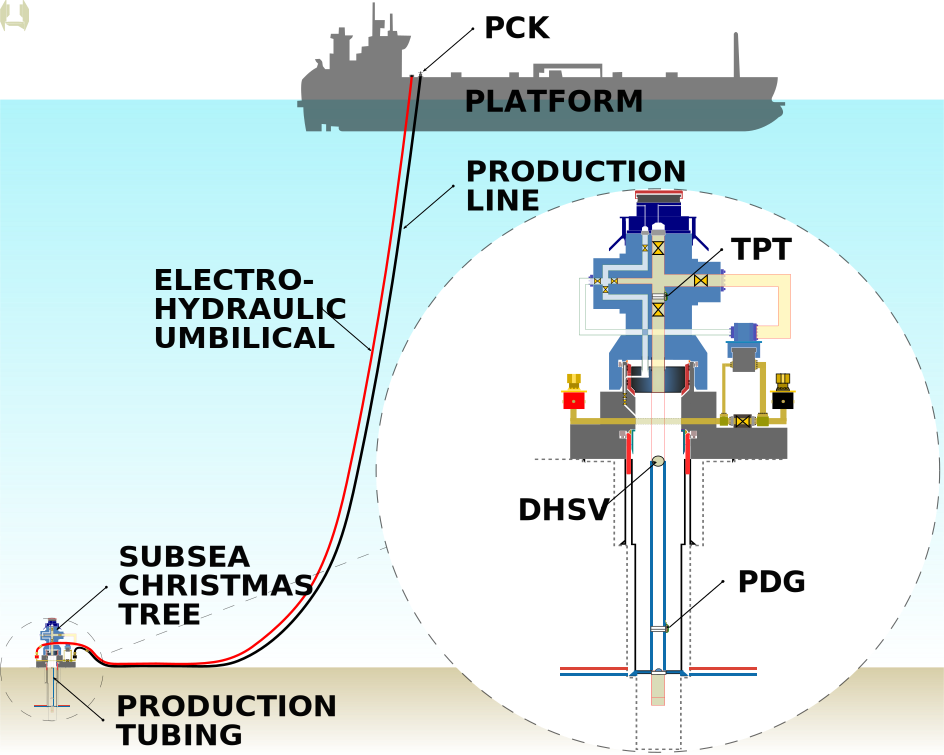

# Data Article About the 3W Dataset 2.0.0

This file contains a ***draft version*** of the [data article](http://researchdata.springernature.com/posts/data-articles-what-are-they-and-how-can-they-benefit-me) intended to be published about the [3W Dataset ***2.0.0***](https://github.com/petrobras/3W/tree/main/dataset).

The content of the following section has been designed with the aim of increasing productivity during the development of this [data article](http://researchdata.springernature.com/posts/data-articles-what-are-they-and-how-can-they-benefit-me) in an open and collaborative way with the [3W Community](https://github.com/petrobras/3W/blob/main/community/README.md).

The following second section contains the ***draft version*** of the [data article](http://researchdata.springernature.com/posts/data-articles-what-are-they-and-how-can-they-benefit-me) itself.

## Alignments Among Authors

The content of this file in its current version is the result of an ***in-depth evaluation*** of the following sources of guidance:

* [For Authors | Scientific Data](https://www.nature.com/sdata/submission-guidelines)
* [Submission Guidelines | Scientific Data](https://www.nature.com/sdata/publish/submission-guidelines)
* [Data Policies | Scientific Data](https://www.nature.com/sdata/policies/data-policies)
* [Data Repository Guidance | Scientific Data](https://www.nature.com/sdata/policies/repositories#general)

All the sections of this file should be duly revised during the development of this [data article](http://researchdata.springernature.com/posts/data-articles-what-are-they-and-how-can-they-benefit-me).

### Definitions

1. This [data article](http://researchdata.springernature.com/posts/data-articles-what-are-they-and-how-can-they-benefit-me) will be submitted to [Scientific Data (Springer Nature)](https://www.nature.com/sdata) according to the following [STAGES AND DEADLINES](STAGES_AND_DEADLINES.md);
    * This definition stems from the following discussion: [How should we publish this article?](https://github.com/ricardoevvargas/data-articles-3w-dataset/discussions/2)
1. This submission will be made through the [Scientific Data online manuscript submission and tracking system](https://mts-scidata.nature.com/cgi-bin/main.plex);
    * At the end of the last stage of this work by [Ricardo Vargas](https://github.com/ricardoevvargas).
1. The publication fee for this [data article](http://researchdata.springernature.com/posts/data-articles-what-are-they-and-how-can-they-benefit-me) (US$ 2,490), charged by [Scientific Data (Springer Nature)](https://www.nature.com/sdata), will be paid by Petrobras;
    * This definition was announced [here](https://github.com/ricardoevvargas/data-articles-3w-dataset/discussions/8);
    * The [3W Project](https://github.com/petrobras/3W) is one of the main projects of the Petrobras' program called [Connections for Innovation  - Open Lab Module](https://tecnologia.petrobras.com.br/modulo-open-lab);
    * The publication of this [data article](http://researchdata.springernature.com/posts/data-articles-what-are-they-and-how-can-they-benefit-me) is essential for the development and success of the [3W Project](https://github.com/petrobras/3W).
1. A copy of the [3W Dataset ***2.0.0***](https://github.com/petrobras/3W/tree/main/dataset) will be deposited at [Figshare](https://figshare.com/) under the [CC-BY](https://creativecommons.org/licenses/by/4.0/) license during this [data article](http://researchdata.springernature.com/posts/data-articles-what-are-they-and-how-can-they-benefit-me) submission process;
    * The [3W Dataset ***2.0.0***](https://github.com/petrobras/3W/tree/main/dataset) is already licensed with [CC-BY](https://creativecommons.org/licenses/by/4.0/). Details [here](https://github.com/petrobras/3W/blob/main/dataset/LICENSE-CC-BY);
    * [Figshare](https://figshare.com/) is the most favorable option among the repositories considered reliable by [Scientific Data (Springer Nature)](https://www.nature.com/sdata). Details [here](https://www.nature.com/sdata/policies/repositories#general);
    * GitHub is not a repository option accepted by [Scientific Data (Springer Nature)](https://www.nature.com/sdata).
1. This [data article](http://researchdata.springernature.com/posts/data-articles-what-are-they-and-how-can-they-benefit-me) will be developed with the [Scientific Data (Springer Nature)](https://www.nature.com/sdata)'s [Data Descriptor](https://www.nature.com/sdata/publish/submission-guidelines#sec-1).
    * The other content types (***article*** and ***comment***) are not suitable for our purpose. Details [here](https://www.nature.com/sdata/publish/submission-guidelines#sec-1).

### Specific Goals with this Draft Version

1. Start the development of this [data article](http://researchdata.springernature.com/posts/data-articles-what-are-they-and-how-can-they-benefit-me) with the right structure;
    * Structure forced by the [Scientific Data (Springer Nature)](https://www.nature.com/sdata)'s [Data Descriptor](https://www.nature.com/sdata/publish/submission-guidelines#sec-1).
1. Facilitate consultation of the guidelines related to the purposes of the [Data Descriptor](https://www.nature.com/sdata/publish/submission-guidelines#sec-1) sections;
    * The purpose of each section is transcribed in this file, highlighted with the 💡emoji, and it shouldn't be edited.
1. Specify the contents in each section to encourage and facilitate contributions by those interested in becoming co-authors of this [data article](http://researchdata.springernature.com/posts/data-articles-what-are-they-and-how-can-they-benefit-me);
    * Contents can be paragraphs, figures, equations, tables, and graphs;
    * Each piece of content is specified in its own unenumerated list item;
    * In some sections (Title, Abstract, Corresponding author, ...), there are no lists of contents, but rather developed ***preliminary versions*** of the contents deemed necessary.
1. Provide a complete and cohesive ***big picture*** of this [data article](http://researchdata.springernature.com/posts/data-articles-what-are-they-and-how-can-they-benefit-me) before each section's content is developed.

### Meaning of the Emojis

* 💡 Highlights the purposes of the existens sections in the [Data Descriptor](https://www.nature.com/sdata/publish/submission-guidelines#sec-1);
* ✅ Indicates that the section is considered ready to be submitted for review;
* ⁉️ Indicates that the section has content listed or drafted, but that it is not yet ready to be submitted for review;
* 👍 Indicates expected contributions in a given section;
* 🚧 Indicates that the section does not have content listed or prepared yet.

### Before You Contribute

The following step-by-step is suggested:

1. Read the [README.md](../README.md);
1. Read [this section](#alignments-among-authors) ***carefully***;
1. Consult the sources and guidelines listed above as necessary;
1. Propose through [Pull Requests](https://docs.github.com/pt/pull-requests/collaborating-with-pull-requests/proposing-changes-to-your-work-with-pull-requests/about-pull-requests) new versions of this file with additional and/or developed content. Corrections and/or improvements to content already developed are also welcome.

## The Data Article

### Title ✅

> 💡 Titles may not exceed 110 characters, including whitespaces. They should avoid the use of acronyms, abbreviations, and unnecessary punctuation where possible. Colons and parentheses are not permitted.

3W Dataset 2.0.0: a realistic and public dataset with rare undesirable real events in oil wells

_Note: the use of the acronym **3W** in the title is intentional and beneficial. Its meaning will be explained in the Background & Summary Section._

### Abstract ⁉️

> 💡 We recommend the Abstract should not exceed 170 words. It should not include references and should succinctly describe the data and how it may be used but should not make any claims regarding new scientific findings. We recommend URLs for download, or other details on dataset access, are not included. Please do not use sub-headings to break the Abstract into sections. 

> 👍 Cohesion, clarity, and English grammar.

In the oil industry, events in wells can cause economic damage, environmental accidents, and human casualties. Solutions based on artificial intelligence or machine learning for early detection have shown promise across industries. In 2019, recognizing the importance and lack of public datasets related to events in producing oil wells, Petrobras developed and publicly released the first version of the 3W Dataset, consisting of Multivariate Time Series labeled by experts as either undesirable events or periods of normal operation. Since then, the 3W Dataset has been explored, and published works have already formed a considerable scientific framework. Over the last few years, Petrobras has further developed the dataset. For example, its structure has been modified, and more labeled data incorporated. This data article describes the 3W Dataset’s current publicly available version, and its publication will encourage and support the 3W Community in developing robust methodologies, digital products, and services that can detect undesirable events early enough to enable corrective or mitigating actions.

### Background & Summary ⁉️

> 💡 This section should provide an overview of the study that generated the data, as well as outlining the potential reuse value of the data. Any previous publications that used these data, in whole or in part, should be cited and briefly summarized. Unlimited length.

> 👍 Excellent references, lack of relevant content, cohesion, clarity, English grammar, and presentation format.

Undesirable events cause different types of damage to the oil industry, including economic, environmental accidents, and human casualties [[1 - Pending]](#1).

Artificial Intelligence (AI) and Machine Learning (ML) based solutions have shown promise for Early Detection [[2]](#2) of undesirable events in different industries [[3 - Pending]](#3). A requirement that is recognized as essential in this type of approach is the use of quality datasets [[4]](#4).

In 2019, Petrobras recognized this need and then developed and published the first version of the 3W Dataset, which is described in detail by Vargas et al. [[5]](#5).

The 3W Dataset is a set of Multivariate Time Series (MTS) [[6]](#6), also called instance, labeled by experts. The name 3W was chosen because this dataset is composed of instances from ***3*** different sources (real, simulated and hand-drawn) and which contain undesirable events that occur in oil ***W***ells. Each instance can contain 100% of the data relating to normality or part of the data relating to a single type of undesirable event. The basic idea is that temporal signatures between multiple variables of each type of event and normality can be learned (modeled) from a set of MTS.

The main features of the 3W Dataset are as follows. Its real instances correspond to the real industrial environment. Frozen variables, missing variables, outliers, etc. are not treated intentionally. The idea is to encourage and enable the development of methodologies and digital products capable of dealing with real adversities. Therefore, it has been advocated that the preservation of characteristics typical of the real industrial environment generates quality datasets. Simulated instances have been added because some types of undesirable events are rare in real life. Hand-drawn instances have been added because some rare events are complicated to simulate and experts are familiar with the behavior of the variables during these events.

As the 3W Dataset has been managed with Semantic Versioning [[7]](#7), its first version is identified by the code 1.0.0.

Since its publication, the 3W Dataset has been explored by several people who make up the 3W Community. These people are independent professionals and representatives of research institutions, startups, companies and oil operators from different countries.

Several works that have been developed and published has formed a considerable scientific framework related to Early Detection of undesirable events in oil wells. This framework is composed by books, conference papers, doctoral theses, final draduation projects, journal articles, master's degree dissertations, repository articles, and specialization monographs.

In 2022, Petrobras created the 3W Project as the first and only pilot of the Open Lab Module of the Connections Program for Innovation [[8]](#8). The purpose of this module is to encourage collaborative and open project developments on the Internet, more specifically on GitHub [[9]](#9). Since then, the 3W Dataset has been maintained and developed in its own corporate Git repository [[10]](#10) on GitHub.

In this same Git repository and as part of the 3W Project, there is also the 3W Toolkit, which is a software package written in Python 3 [[11]](#11) whose purpose is to facilitate and encourage exploration of the 3W Dataset and proposals for comparative approaches.

In addition to these two main resources, 3W Dataset and 3W Toolkit, this Git repository [[10]](#10) also provides:

- Detailed description of the motivation, strategy, ambition, governance, and other aspects of the 3W Project;
- Lists with at least 100 published works that cite the 3W Dataset;
- Specification of priority problems (benchmarks);
- The 3W Project contributing guide;
- Information about the 3W Community;
- 3W Dataset overviews developed by the 3W Community;
- The 3W Community code of conduct;
- Release notes for the published versions of the 3W Dataset.

Since 2022, the 3W Dataset has also been evolved by Petrobras and its current publicly available version is identified by the code 2.0.0.

This data article details the 3W Dataset 2.0.0 and summarizes the advances incorporated into this version since version 1.0.0. The content of this data article will support the 3W Community to develop robust methodologies, digital products and services that can detect undesirable events in oil wells early enough to enable corrective or mitigating actions.

### Methods ⁉️

> 💡 The Methods section in Data Descriptors should describe any steps or procedures used in producing the data, including full descriptions of the experimental design, data acquisition and any computational processing. Unlimited length.

> 👍 Excellent references, lack of relevant content, cohesion, clarity, English grammar, presentation format, and figure generation.

In a nutshell, the 3W Dataset 2.0.0 is made up of three types of instances and was generated with three methods, one per type of instance. These methods are described in this section and are based on the mathematical definition of MTS presented in the following subsection. According to this definition and to support both the 3W Project and this article, a nomenclature was developed and is detailed in the subsequent subsection. The types of instances and the methods associated with them are described in their own subsections. Certain characteristics are common to all three methods and are therefore detailed in a separate subsection.

#### Mathematical Definition of Multivariate Time Series

The chosen definition for MTS is the same as that used in the article that published the 3W Dataset 1.0.0 [[5]](#5). This definition is reproduced below.

A dataset ***DS*** is a set of _m_ MTS (S_i_ | _i_ = {1, 2, …, _m_}, ∀ _m_ ∈ Z, and _m_ > 1) and is defined as ***DS*** = {***S***1, ***S***2, …, ***S***_m_}. Each MTS _i_ is an instance that is composed of a set of _n_ univariate time series (x_i__j_ | _j_ = {1, 2, …, _n_}, ∀ _n_ ∈ Z, and _n_ > 1) (also referenced as process variable or just variable), and is defined as ***S***_i_ = {_x__i_1, _x__i_2, …, _x__i__n_}. Each variable _j_ that composes an MTS _i_ is an ordered temporal sequence of _p__i_ observations taken at the time _t_ (_x__i__j,t_ | _t_ = {1, 2, …, _p__i_}, ∀ _p__i_ ∈ Z, and _p__i_ > 1). Therefore, each MTS _i_ is viewed in this work as a matrix defined as S_i_ = {_x__i_1,1, _x__i_2,1, ..., _x__i__n_,1; _x__i_1,2, _x__i_2,2, ..., _x__i__n_,2; _x__i_1,_p__i_, _x__i_2,_p__i_, ..., _x__i__n_,_p__i_}.

Note that all instances have a fixed number of variables _n_, but each instance can be composed of any quantity of observations _p__i_. It is also important to note that all variables of an instance _i_ have fixed number
of observations _p__i_.

#### The Developed Nomenclature

The terms that make up the nomenclature used in this work are derived from the definition of MTS presented in the previous section. These terms are shown in Table 1.

**Table 1** Terms that make up the nomenclature used in this work.
| **Term** | **Meaning** |
| -------- | ------- |
| Variable | Physical quantity at a specific point in the production system of a specific well from which values are acquired to generate a univariable time series _j_: _x__j_ |
| Timestamp | Instant _t_ (date + time) at which values are acquired or generated and then associated with variables: YYYY-MM-DD HH:MM:SS |
| Observation | Vector with values from _n_ variables of a single instance _i_ acquired at a timestamp _t_: {_x__i_1,t, _x__i_2,t, ..., _x__i__n_,t} |
| Label | Marking determined by an expert regarding the well condition in terms of a particular property. The labeling process is explained in Subsection [Common Characteristics Among the Methods](#common-characteristics-among-the-methods) |
| Class label | Marking determined by an expert regarding the well condition in terms of occurrence of an undesirable event or normality. See additional explanation in Subsection [Common Characteristics Among the Methods](#common-characteristics-among-the-methods) |
| State label | Marking determined by an expert regarding the well condition in operational terms. See additional explanation in Subsection [Common Characteristics Among the Methods](#common-characteristics-among-the-methods) |
| Sample | Part of an MTS, including all _n_ variables and all observations between two timestamps |
| Period | A sample that respects the following two conditions: all its observations are labeled with the same class label and it is not contained in another temporally larger sample with all observations labeled with the same class label. In other words, a period is the largest possible sample whose observations are labeled with the same class label |
| Instance | Collection of temporally sequential periods associated with a specific well |
| Type of event | Operational states in which a well can find itself, including normality, failures and undesired states |
| Dataset | Set of instances with multiple types of events |

#### Types of Instances

As mentioned at the beginning of this section, the 3W Dataset 2.0.0 is made up of three types of instances, called real, simulated and hand-drawn.

Each of these types of instances has been fundamentally defined according to the origin of its data. Data from real instances were obtained from different Petrobras Plant Information Management Systems (PIMS) [[12 - Pending]](#12), more precisely different AVEVA PI System [[13]](#13) environments. Data from simulated instances were generated with OLGA [[14]](#14), a dynamic multiphase flow simulator adopted by several oil companies around the globe. And data from hand-drawn instances was literally drawn by experts and extracted with a digital tool developed exclusively for this purpose.

Each type of instance, and therefore each data source, required the development of its own method for acquiring and labeling data. The common characteristics among the three developed methods are described in the following subsection. The particularities of each method are detailed in the subsequent subsections.

#### Common Characteristics Among the Methods

All instances, regardless of their type, are related to satellite-type offshore producing wells without manifold [[15 - Pending]](#15). This type of well can be operated with different lifting methods [[16 - Pending]](#16) interspersed over time, sometimes with the natural method and sometimes with an artificial lifting method. The natural method can only be used when the reservoir pressure is sufficient to produce hydrocarbons at a commercial rate without requiring any additional energy. Otherwise, some artificial lifting method is required precisely so that extra energy can be added to the system.

Fig. 1 contains a diagram representing the considered scenario when designing the 3W Dataset 2.0.0. This diagram only covers the components necessary for a good understanding of how the 3W Dataset 2.0.0 was conceived. In summary, this diagram shows the production platform, the well itself, the subsea Christmas tree [[17 - Pending]](#17), the production and service lines, as well as sensors and valves.

<table align="center" style="margin: 0px auto;">
  <tr>
    <td><b>Fig. 1</b> Note: this figure needs to be replaced. The idea is to show the equipment and locations in the production system from which data is acquired for the 27 variables contained in version 2.0.0 of the 3W Dataset.  Diagram representing the considered scenario when designing the 3W Dataset 2.0.0.</td>
  </tr>
</table>

There are 27 variables present in all instances of the 3W Dataset 2.0.0. According to the used definition of MTS, even if data has not been obtained or generated for a certain variable in a certain instance, that variable is part of that instance. The name of each of these variables, what it represents and its physical position in the considered scenario (see Fig. 1) are shown in Table 2.

**Table 2** Details of the variables in the 3W Dataset 2.0.0.
| **Name** | **Description** | **Position** |
| -------- | ------- | ------- |
| ABER-CKGL | Opening of the GLCK (gas lift choke) | ?Position - Pending? |
| ABER-CKP | Opening of the PCK (production choke) | ?Position - Pending? |
| ESTADO-DHSV | State of the DHSV (downhole safety valve) | ?Position - Pending? |
| ESTADO-M1 | State of the PMV (production master valve) | ?Position - Pending? |
| ESTADO-M2 | State of the AMV (annulus master valve) | ?Position - Pending? |
| ESTADO-PXO | State of the PXO (pig-crossover) valve | ?Position - Pending? |
| ESTADO-SDV-GL | State of the gas lift SDV (shutdown valve) | ?Position - Pending? |
| ESTADO-SDV-P | State of the production SDV | ?Position - Pending? |
| ESTADO-W1 | State of the PWV (production wing valve) | ?Position - Pending? |
| ESTADO-W2 | State of the AWV (annulus wing valve) | ?Position - Pending? |
| ESTADO-XO | State of the XO (crossover) valve | ?Position - Pending? |
| P-ANULAR | Pressure in the well annulus | ?Position - Pending? |
| P-JUS-BS | Downstream pressure of the SP (service pump) | ?Position - Pending? |
| P-JUS-CKGL | Downstream pressure of the GLCK | ?Position - Pending? |
| P-JUS-CKP | Downstream pressure of the PCK | ?Position - Pending? |
| P-MON-CKGL | Upstream pressure of the GLCK | ?Position - Pending? |
| P-MON-CKP | Upstream pressure of the PCK | ?Position - Pending? |
| P-MON-SDV-P | Upstream pressure of the production SDV | ?Position - Pending? |
| P-PDG | Pressure at the PDG (permanent downhole gauge) | ?Position - Pending? |
| PT-P | Downstream pressure of the PWV in the production tube | ?Position - Pending? |
| P-TPT | Pressure at the TPT (temperature and pressure transducer) | ?Position - Pending? |
| QBS | Flow rate at the SP | ?Position - Pending? |
| QGL | Gas lift flow rate | ?Position - Pending? |
| T-JUS-CKP | Downstream temperature of the PCK | ?Position - Pending? |
| T-MON-CKP | Upstream temperature of the PCK | ?Position - Pending? |
| T-PDG | Temperature at the PDG | ?Position - Pending? |
| T-TPT | Temperature at the TPT | ?Position - Pending? |

All instances were generated with observations taken every 1 second. In other words, the sampling frequency in all instances is fixed at 1 Hz.

All the variables associated with each physical quantity (type of variable) are represented with the same measurement unit according to Table 3.

**Table 3** Physical quantities and their measurement units.
| **Physical Quantity** | **Measurement Unit** |
| -------- | ------- |
| Choke opening | % |
| Flow rate | m3/s | 
| Pressure | Pa |
| Temperature | oC |
| Valve state | Adimensional: 0 for closed, 1 for open, and 0.5 for any other state |

The labeling process applied to all instances of the 3W Dataset 2.0.0 resulted in two types of labels, called class labels and state labels. The class labels are directly related to normality or to some undesirable event. The state labels are directly related to the operational status of the well in question. 

The numerical codes associated with the class labels are detailed in Table 4. Any of these codes can be associated with any observation from any instance. Codes 101 to 109 represent transient conditions between normality and steady states referring to undesirable events. It is important to note that not all undesirable events have transient conditions associated with them. When the well condition in terms of occurrence of an undesirable event or normality is unknown at any time, the associated observation is labeled with the class label Unknown (code = NaN = Not a Number). Each instance as a whole is associated with the only steady state code (1 to 9) to which at least part of its observations have been associated. This code is referenced as the type of event.

**Table 4** Class labels and their numerical codes.
| **Numerical Code** | **Class Label** |
| -------- | ------- |
| 0 | Normal Operation |
| 1 | Abrupt Increase of BSW |
| 2 | Spurious Closure of DHSV |
| 3 | Severe Slugging |
| 4 | Flow Instability |
| 5 | Rapid Productivity Loss |
| 6 | Quick Restriction in PCK |
| 7 | Scaling in PCK |
| 8 | Hydrate in Production Line |
| 9 | Hydrate in Service Line |
| 101 | Transient: Abruption Increase of BSW |
| 102 | Transient: Spurious Closure of DHSV |
| 105 | Transient: Rapid Productivity Loss |
| 106 | Transient: Quick Restriction in PCK |
| 107 | Transient: Scaling in PCK |
| 108 | Transient: Hydrate in Production Line |
| 109 | Transient: Hydrate in Service Line |
| NaN | Unknown |

The numerical codes associated with the state labels are detailed in Table 5. Any of these codes can also be associated with any observation from any instance. None of these codes are associated with any instance as a whole. When the well operating condition is unknown at any time, the associated observation is labeled with the state label Unknown (code = NaN).

**Table 5** State labels and their numerical codes.
| **Numerical Code** | **State Label** |
| -------- | ------- |
| 0 | Open |
| 1 | Shut-In |
| 2 | Flushing Diesel |
| 3 | Flushing Gas |
| 4 | Bullheading |
| 5 | Closed With Diesel |
| 6 | Closed With Gas |
| 7 | Restart |
| 8 | Depressurization |
| NaN | Unknown |

#### Method Relating to Real Instances

The particularities of the method developed for real data are listed below.

* Regarding data acquisition:
    1. From records in Petrobras' PIMS [[12 - Pending]](#12), more precisely different AVEVA PI System [[13]](#13) environments;
    1. With linear interpolation provided by the AVEVA PI System;
    1. No treatments for frozen variables or missing values;
    1. With conversion to standard measurement units.
* Regarding labeling:
    1. By experts using a Petrobras' web system developed exclusively for labeling and exporting real data to the 3W Dataset.

The main limitations of this method are:

1. Coverage of only events that took place in real life and had archived records;
1. Contextualizations (mappings between variables and tags in PIMS) were not verified;
1. Original measurement units (before conversions) were not verified.

#### Method Relating to Simulated Instances

The particularities of the method developed for simulated data are listed below.

* Regarding data generation:
    1. By planning a matrix of simulations with OLGA [[14]](#14), gradually varying the main parameters of the considered scenario;
    1. Running simulations and filtering out those whose results did not converge (well did not produce normally);
    1. Automated extraction of time series from TPL files generated by OLGA and relating to successful simulations;
    1. With perfectly periodic time series;
    1. No frozen variables or missing values;
    1. With variables already represented with standardized measurement units;
    1. Without any noise in the time series.
* Regarding labeling:
    1. Fully automated from simulation results.

The main limitations of this method are:

1. Use of a single model associated with a single well;
1. Use of a simplified simulation strategy. Example: hydrates were simulated using a valve with a linear closing percentage.

#### Method Relating to Hand-Drawn Instances

The particularities of the method developed for hand-drawn data are listed below.

* Regarding data generation:
    1. Proprietary tool based on image processing developed exclusively for generating hand-drawn data for the 3W Dataset;
    1. Each variable hand-drawn on its own chart by a expert. An example is shown in Fig. 2;
    1. Automated digitization of time series via scanning graphs printed on paper.
* Regarding labeling:
    1. From expert markings on the graphs printed on paper.

The main limitations of this method are:

1. Coverage of only the well-known signatures of undesirable events;
1. Expert bias when drawing and labeling time series;
1. Expert manual dexterity.

<table align="center" style="margin: 0px auto;">
  <tr>
    <td><b>Fig. 2</b>  Example of a variable drawn and labeled by hand by an expert in the tool developed exclusively for generating instances for the 3W Dataset.</td>
  </tr>
</table>

### Data Records ⁉️

> 💡 This section should be used to explain each data record associated with this work, including the repository where this information is stored, and to provide an overview of the data files and their formats and any folder structure. Please do not include extensive summary statistics, which should be limited to less than half a page, with 1-2 tables or figures, if required at all. Note the general expectation is that, if readers wish to scrutinise your dataset's contents, they will download and analyse it for themselves. Unlimited length.

> 👍 Lack of relevant content, cohesion, clarity, English grammar, and presentation format.

The 3W Dataset 2.0.0 is licensed under CC-BY 4.0 and is publicly available at the following Figshare [[18]](#18) address: https://figshare.com/articles/dataset/pending.

An overview (main quantities and statistics) of this dataset is presented in the next subsection. The subsequent subsection details how the data records are structured.

#### 3W Dataset 2.0.0 Overview

The quantities of instances that compose the 3W Dataset 2.0.0, by type of instance and by type of event, are shown in Table 6.

**Table 6** Quantities of instances that compose the 3W Dataset 2.0.0.
| **Type of Event** | **Real** | **Simulated** | **Hand-Drawn** | **Total** |
| -------- | ------- | ------- | ------- | ------- |
| 0 - Normal Operation | 594 | 0 | 0 | 594 |
| 1 - Abrupt Increase of BSW | 4 | 114 | 10 | 128 |
| 2 - Spurious Closure of DHSV | 22 | 16 | 0 | 38 |
| 3 - Severe Slugging | 32 | 74 | 0 | 106 |
| 4 - Flow Instability | 343 | 0 | 0 | 343 |
| 5 - Rapid Productivity Loss | 11 | 439 | 0 | 450 |
| 6 - Quick Restriction in PCK | 6 | 215 | 0 | 221 |
| 7 - Scaling in PCK | 36 | 0 | 10 | 46 |
| 8 - Hydrate in Production Line | 14 | 81 | 0 | 95 |
| 9 - Hydrate in Service Line | 57 | 150 | 0 | 207 |
| Total | 1119 | 1089 | 20 | 2228 |

A scatter map with all the real instances is shown in Fig. 3. The oldest intance occurred in the middle of 2011 and the most recent one in the middle of 2023. In addition to the total number of considered wells (42), this map provides an overview of the occurrences distributions of the instances over time and between wells.

<table align="center" style="margin: 0px auto;">
  <tr>
    <td><b>Fig. 3</b>  Scatter map with all the real instances in the 3W Dataset 2.0.0.</td>
  </tr>
</table>

The 3W dataset's main statistics related to inherent difficulties of actual data are presented in Table 7.

**Table 7** The 3W dataset's main statistics related to inherent difficulties of actual data.
| **Statistic** | **Amount** | **Percentage** |
| -------- | ------- | ------- |
| Missing Variables | 41109 | 65.90% of 62384 |
| Frozen Variables | 6095 | 9.77% of 62384 |
| Unlabeled Observations | 4028400 | 5.26% of 76587318 |

#### 3W Dataset 2.0.0 Structure

In the root of the directory containing the dataset there is a file called dataset.ini, which specifies properties of the 3W Dataset 2.0.0. The proposal is that all users concentrate their searches for these properties in this file.

The data itself in the 3W Dataset 2.0.0 is organized in subdirectories dedicated to each type of event. The name of each directory is the numerical code associated with each type of event (see Table 4).

Each instance is persisted in its own Apache Parquet file [[19]](#19), or simply Parquet file, an open source, column-oriented data file format designed for efficient data storage and retrieval. It provides high performance compression and encoding schemes to handle complex data in bulk and is supported in many programming language and analytics tools.

The logic used to formulate file names depends on the type of instance.

The name of each real instance is composed as follows: WELL-[incremental id]_[timestamp of oldest observation].parquet. Example: WELL-00014_20170917140000.parquet. Each real well is associated with a unique id, regardless of the type of event (subdirectory).

The name of each simulated instance is composed as follows: SIMULATED_[incremental id].parquet. Example: SIMULATED_00072.parquet. The incremental id is initialized from 1 for each type of event (subdirectory).

The name of each hand-drawn instance is composed as follows: DRAWN_[incremental id].parquet. Example: DRAWN_00007.parquet. The incremental id is initialized from 1 for each type of event (subdirectory).

All Parquet files are created with Pyarrow engine [[20]](#20) and Brotli compression [[21]](#21). These choices were made on the basis of the good compromise between compression ratio and reading time.

The timestamps vector of each instance is used as index in the corresponding Parquet file. All timestamps are represented in the format 'YYYY-MM-DD HH:MM:SS'.

All variables and labels are stored in columns of Parquet files, variables as float and labels as Int64 (not int64).

### Technical Validation ⁉️

> 💡 This section should present any experiments or analyses that are needed to support the technical quality of the dataset. This section may be supported by figures and tables, as needed. Unlimited length.

> 👍 Lack of relevant content, cohesion, clarity, English grammar, and presentation format.

Several features that have been carefully incorporated into the methods described in the Methods Section ensure that the 3W Dataset 2.0.0 has high technical quality. The main ones are as follows:

* In the real instances: maintenance of real data characteristics, labeling by experts, and validation by expert committee;
* In the simulated instances: simulation models calibrated by experts, and systematized labeling;
* In the hand-drawn instances: hand-drawn graphs by experts, and systematized labeling.

The quantity and the diversity of the works developed and published by the 3W Community show the relevance and the technical quality of the 3W Dataset. This scientific framework is made up of dozens of published works, including books, conference papers, doctoral theses, final draduation projects, journal articles, master's degree dissertations, and specialization monographs. More information on these works can be found in the 3W Project repository [[10]](#10).

### Usage Notes ⁉️

> 💡 'Usage Notes' is an optional section that can be used to provide information that may assist other researchers who reuse your data. Most commonly these are additional technical notes about how to access or process the data. Please do not use this section to write a conclusions section, or similar, as we do not publish these. Unlimited length.

> 👍 Lack of relevant content, cohesion, clarity, English grammar, and presentation format.

This data article describes the 3W Dataset 2.0.0, the current publicly available version, and details its evolution with respect to version 1.0.0, which is detailed by Vargas et al. [[5]](#5).

The 3W Dataset 2.0.0 was generated with code written in Python 3.10 [[11]](#11) and the main used resources were from the Pandas 1.5 [[22]](#22) and Pyarrow 19.0 [[20]](#20) packages. 

The 3W Dataset 2.0.0 was designed to be explored with basically any programming language (not just Python). Regardless of the language used, the Parquet files [[19]](#19) must be read with the Pyarrow method and the Brotli compression [[21]](#21).

When comparing results obtained in different works, it is important to note which versions of the 3W Dataset were used. Certain comparisons can be complex due to the significant differences between the versions of the 3W Dataset published so far. The main changes incorporated in version 2.0.0 compared to version 1.0.0 are as follows:

1. Its structure was considerably modified. Data is now saved in Parquet files, and no longer in CSV files; 
1. 1 variable was discontinued (T-JUS-CKGL) and 20 others were added, resulting in 27 variables in the current version;
1. 1 undesirable type of event has been added: Hydrate in Service Line;
1. The number of real instances increased by 94;
1. The number of simulated instances increased by 150;
1. The number of actual wells covered rose from 21 to 42;
1. More labeled data (observations) were incorporated.

More details can be found in the release notes available in the 3W Project repository [[10]](#10).

### Code Availability ⁉️

> 💡 For all publications, a statement must be included under the subheading "Code Availability" indicating whether and how and custom code can be accessed, including any restrictions to access. This section can also include information on the versions of any software used, if relevant, and any specific variables or parameters used to generate, test, or process the current dataset if these are not included in the Methods. Please see our policy on code availability for more information. The code availability statement should be placed at the end of the manuscript, immediately before the references. If no custom code has been used then the statement is still required in order to state this. 

> 👍 Lack of relevant content, cohesion, clarity, English grammar, and presentation format.

The 3W Project also develops and makes publicly available in its Git repository [[10]](#10) the 3W Toolkit, which is a software package written in Python 3 [[11]](#11) and licensed under Apache 2.0 [[23]](#23). Its purpose is to facilitate and encourage exploration of the 3W Dataset and proposals for comparative approaches. It provides a range of features for loading data, visualizing time series, calculating metrics, etc.

Python practitioners can therefore use and adapt the 3W Toolkit to speed up their analysis with the 3W Dataset 2.0.0.

An in-depth description of the 3W Toolkit is beyond the scope of this data article, but its documentation and examples of use can be found in the 3W Project repository [[10]](#10).

### Acknowledgements ✅

> 💡 The 'Acknowledgements' statement should contain text acknowledging non-author contributors. Acknowledgements should be brief, and should not include thanks editors or effusive comments. Grant or contribution numbers may be acknowledged.

The authors would like to thank Petróleo Brasileiro S.A. (Petrobras) for providing all the necessary resources for the preparation and publication of this data article.

### Authors & Affiliations ⁉️

> 💡 Author affiliations should provide enough detail for the author to be reached, including the department, institution and country wherever possible. Full postal addresses are not required. Affiliations should be cited in numerical order within the author list, starting with the affiliations of the first author. Email addresses should be provided for corresponding authors.

* Petróleo Brasileiro S.A. (Petrobras), Rio de Janeiro, Brazil
    * Ricardo Emanuel Vaz Vargas, Author Name, Author Name, ..., Author Name & Author Name (in alphabetical order)
* Affiliation
    * Author Name, Author Name, ..., Author Name & Author Name (in alphabetical order)
* ...
* Affiliation
    * Author Name, Author Name, ..., Author Name & Author Name (in alphabetical order)

_Note: when you propose contributions through [Pull Request](https://docs.github.com/pt/pull-requests/collaborating-with-pull-requests/proposing-changes-to-your-work-with-pull-requests/about-pull-requests), add your name in association with your affiliation in the list above._

### Author Contributions ⁉️

> 💡 The 'Author contributions' statement should briefly describe each author's contribution to the work.

R.V. lead this project, prepared this manuscript drafts version, and incorporated contributions from all co-authors to produce the submitted and published versions. A.B did it. C.D did that.

_Note: when you propose contributions through [Pull Request](https://docs.github.com/pt/pull-requests/collaborating-with-pull-requests/proposing-changes-to-your-work-with-pull-requests/about-pull-requests), add your initials and summarize your contributions in the list above, which cannot be subdivided._

### Corresponding Author ✅

> 💡 The named 'corresponding author' on the system is the main point of contact for peer review. The named 'corresponding author' in the paper is the main point of contact for publication. These do not have to be the same and only the information in the article file is published. Email addresses should be provided for corresponding authors.

Correspondence to Ricardo Emanuel Vaz Vargas (ricardo.vargas@petrobras.com.br).

### Competing Interests ✅

> 💡 A 'Competing interests' statement is required for all papers accepted by and published in Scientific Data. If there is no conflict of interest, a statement declaring this must still be included in the manuscript (e.g. "The author(s) declare no competing interests").

The authors declare no competing interests.

### References 🚧

> 💡 All references should be numbered sequentially, first throughout the text, then in tables, followed by figures and, finally, boxes; that is, references that only appear in tables, figures or boxes should be last in the reference list. Only one publication is given for each number. Only papers that have been published or accepted by a named publication or recognized preprint server should be in the numbered list; preprints of accepted papers in the reference list should be submitted with the manuscript.Grant details and acknowledgments are not permitted as numbered references. Footnotes are not used. Scientific Data suggests the use of the standard Nature referencing style. See examples [here](https://www.nature.com/sdata/publish/submission-guidelines#sec-4). In addition, we encourage the use of DOIs for all items that have them, as the easiest method for readers to find content. These may be appended to the end of any reference in URL format (https://doi.org/DOI, where DOI is the relevant number). 

#### 1
Pending.
#### 2
Panza, M.A., Pota, M., & Esposito, M. (2023). Anomaly Detection Methods for Industrial Applications: A Comparative Study. Electronics, 12, 3971. https://doi.org/10.3390/electronics12183971
#### 3
Pending.
#### 4
Gong, Y., Liu, G., Xue, Y., Li, R., & Meng, L. (2023). A survey on dataset quality in machine learning. Information and Software Technology, 162, 107268. https://doi.org/10.1016/j.infsof.2023.107268
#### 5
Vaz Vargas, R. E., Munaro, C. J., Marques Ciarelli, P., Gonçalves Medeiros, A., Guberfain do Amaral, B., Centurion Barrionuevo, D., Dias de Araújo, J. C., Lins Ribeiro, J., & Pierezan Magalhães, L. (2019). A realistic and public dataset with rare undesirable real events in oil wells. Journal of Petroleum Science and Engineering, 181. https://doi.org/10.1016/j.petrol.2019.106223.
#### 6
Tsay, R. S. (2010). Multivariate time series analysis and its applications. In Analysis of financial time series (pp. 389–465). John Wiley & Sons, Ltd. https://doi.org/10.1002/9780470644560.ch8
#### 7
Preston-Werner, T. (2013). Semantic Versioning 2.0.0. http://semver.org.
#### 8
Petróleo Brasileiro S.A. (Petrobras) (2025). Open Lab Module of the Connections Program for Innovation. https://conexoes-inovacao.petrobras.com.br/s/openlab?language=en_US.
#### 9
Microsoft Corporation (2025). GitHub. https://github.com.
#### 10
Petróleo Brasileiro S.A. (Petrobras) (2025). The 3W Project. https://github.com/petrobras/3W.
#### 11
Python Software Foundation. Python Language Reference. http://www.python.org.
#### 12
Pending.
#### 13
AVEVA (2025). AVEVA PI System. https://www.aveva.com/en/products/aveva-pi-system.
#### 14
SLB (2025). OLGA. https://www.slb.com/products-and-services/delivering-digital-at-scale/software/olga.
#### 15
Pending.
#### 16
Pending.
#### 17
Pending.
#### 18
Figshare LLP (2025). Figshare. https://info.figshare.com.
#### 19
Apache Software Foundation (2025). Apache Parquet. https://parquet.apache.org.
#### 20
Apache Software Foundation (2025). PyArrow. https://arrow.apache.org/docs/index.html.
#### 21
J. Alakuijala & Z. Szabadka (2016). Brotli Compressed Data Format. Internet Engineering Task Force (IETF). Request for Comments: 7932. https://www.ietf.org/rfc/rfc7932.txt.
#### 22
The pandas development team (2020). pandas-dev/pandas: Pandas. https://doi.org/10.5281/zenodo.3509134.
#### 23
Apache Software Foundation (2004). Apache License Version 2.0. https://www.apache.org/licenses/LICENSE-2.0.txt.
